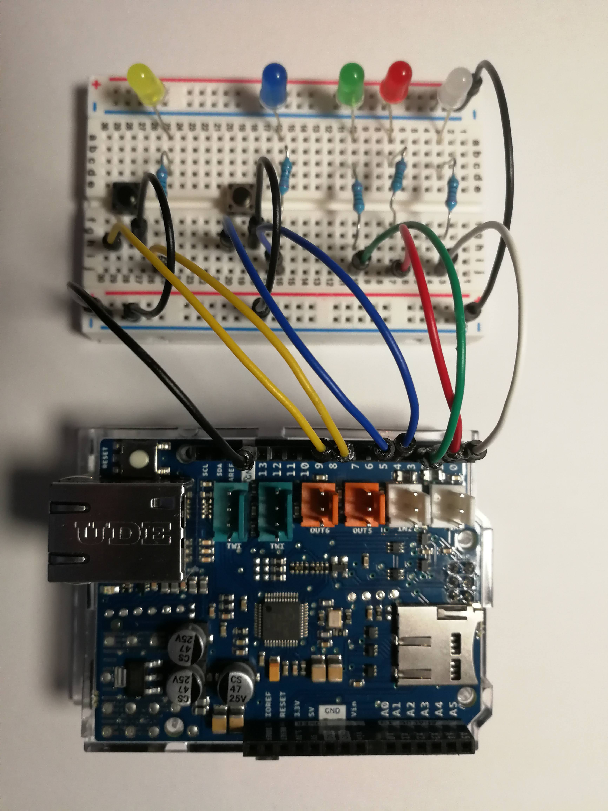

# Robot racine

**IMPORTANT NOTICE: AT THE MOMENT THIS PROJECT IS STILL IN TESTING STATE. THE ARDUINO BOARD IS CONNECTED TO A BREAD BOARD SIMULATOR WITH LEDs NOT TO THE REAL ROBOT RACINE.**


- [Robot racine](#robot-racine)
  - [Introduction](#introduction)
  - [Installation](#installation)
    - [Prerequisits](#prerequisits)
    - [Material needed](#material-needed)
    - [Software dependencies](#software-dependencies)
    - [First things first](#first-things-first)
    - [Installing the Arduino firmware](#installing-the-arduino-firmware)
    - [Testing the arduino firmware](#testing-the-arduino-firmware)
    - [Installing kivy UI](#installing-kivy-ui)
    - [Testing the UI](#testing-the-ui)
  - [User manual](#user-manual)
    - [About jobs](#about-jobs)
    - [Launching the UI](#launching-the-ui)
    - [Start up page](#start-up-page)
    - [Manual override](#manual-override)
    - [Capture](#capture)
    - [Jobs](#jobs)
    - [Data In](#data-in)
    - [Log](#log)
    - [Settings Page](#settings-page)
  - [Other scripts](#other-scripts)
    - [send_images.py](#send_imagespy)
    - [camera_setting.py](#camera_settingpy)

## Introduction

This repository contains both the UI and the firmware needed to to run Robot Racine.

## Installation

Sorry, but this is going to neither easy nor quick.

### Prerequisits

There are some things with which you should be confortable with before attempting to build this system.

- Linux:
  - installing and updating pacages
  - Modifying configuration files
  - SSH (recommended)
- Python:
  - Creating environments
  - Installing packages
  - Debugging (recommended)
- Arduino
  - Installing IDE and libraries
  - Uploading firmwares and using the serial monitor
  - Building small contraptions (recommended)

### Material needed

- Raspberry Pi single board computer, tested with 3B.
- Touch screen for Raspberry Pi.
- Pi camera.
- Arduino Uno WiFi R2.
- USB camera.
- Personal computer and USB cable to upload the firmware to the Arduino board.
- A bread board with cables LEDs and buttons (recommended)

### Software dependencies

- Packages
  - libsdl2-dev
  - libsdl2-image-dev
  - libsdl2-mixer-dev
  - libsdl2-ttf-dev
  - pkg-config
  - libgl1-mesa-dev libgles2-mesa-dev
  - python-setuptools
  - libgstreamer1.0-dev git-core
  - gstreamer1.0-plugins-{bad,base,good,ugly}
  - gstreamer1.0-{omx,alsa}
  - python-dev libmtdev-dev
  - xclip xsel libjpeg-dev
- Python, used 3.7, not tested with other versions
  - kivy, to install kivy refer to the [Kivy installation page](https://kivy.org/doc/stable/gettingstarted/installation.html)
  - PiCamera
  - numpy
  - pandas
- An IDE to upload the firmware to the Arduino board
  - Used Arduino IDE
  - Firmware will need to be modified to be used with PlatformIO

### First things first

Clone this repositoryon your Raspberry Pi (and on your computer if you want to use it for the Arduino part or remote debuggong).

### Installing the Arduino firmware

The fimrware is located in the rr_kv_firmware folder.  
You need an Arduino compatible IDE, before pushing the firmware to the make sure that you have the following libraries installed: SPI, WiFiNINA, WiFiUdp.  
In the firmware folder there is a wifi_credentials.h where you have to put your WiFi's SSID and password.
Connect your arduino board to your computer with an USB cable, open the serial monitor and upload the firmware.  
If everything goes well the serial monitor will show something like this:  
  

### Testing the arduino firmware

If you enter the Arduino address into a navigator you should see this page.  
  
Normally testing is done with circuit on a bread board as seen in the image bellow. This board can be reproduced from the image and the firmware code.  
  
In the absence of the simulator, time outs will act in place of buttons and feedback will be displayed on the serial port.

### Installing kivy UI

- Connect the Raspberry to the same network as the Arduino.
- Install python and all the dependencies listed in the Linux dependencies section.
- Create a Python environment and install the required packages.
- In the data/settings.json file enter the Arduino IP address.
- Modify the ~/.kivy/config.ini *input* section as follows, needed for issues with Kivy and touchscreens:

```
[input]
mouse = mouse
%(name)s = probesysfs,provider=hidinput
mtdev_%(name)s = probesysfs,provider=mtdev
hid_%(name)s = probesysfs,provider=hidinput
```

### Testing the UI

Launch the UI, the main script is src/ui_main.py.  
To test the UI use the manual overrides as seen in the user manual.

## User manual

### About jobs

Upon starting a job the UI will change to the start up page and reduce the interractivity, only the log and capture pages will be accessible.

### Launching the UI

To launch the UI activate the environment then go to the src folder and type:  

````shell
python ui_main.py
````

Upon starting the robot will always be in an unknown state, where the system does not know the position of the plants. In order to fix the issue, the **home** option in the manual oerride page can be pressed. This is not needed since there's always a **home** order issued at the begining and end of any job.

### Start up page


This is the main page of the UI.  
The top and buttom rows are displayed on all pages. In the top row you have the name of the page currently displayed and the count down to the next job or the state of the current job.  
The button row has the **stop** button, a place where messages will be displayed and the **back**/**exit** button.  
The middle row contains acces to the remaing UI pages:

- Manual override: Direct control of the robot, can be used for testing.
- Capture: Manual snapping.
- Jobs: View, add, delete and edit jobs.
- Data in: View, add and delete plants.
- Log: View application massages.
- Settings: Modify UI settings.

### Manual override


- Home: Move the robot to the home position, can be interrupted by the sop button.
- Start: Start the robot moter.
- Stop: Stop the robot motor, can interrupt all other actions. Upon calling the sop command the robot will be set to an unknown state and a home action will be needed.
- Next: Position the next plant in the camera ready position.

### Capture


You can take a picture at any time (except when a job is in progress) if you check the *Save snapped image*, the image will be saved to the *data/images/to_keep* folder.  
If a job is in progress, the capture page can be used to view the pictures as they're taken.

### Jobs


On the right there's the bos list and the **Add..** button at the bottom.  
On the middle is the selected job editable data:

- Name, description: Used to diferenciate the job.
- Owner: Name of the job owner.
- Mail to: Mail to this people when job events arise. **Not implemented yet**.
- Start: when to start the job, three options available:
  - **Every**: The job will run every X hours.
  - **At**: The job will run at the specified hours every day.
  - **Once**: Execute the only once at start date.
- From->To: The job will be active between the two dates.
- Plants: List of plants to be imaged in the job, use the edit button to add and remove plants.

### Data In


Add or remove *Data In* files to insert or delete plants in the system.

### Log


View the current session log information.

### Settings Page


Edit UI settings

## Other scripts

### send_images.py

This script is launched by the UI every 6 minutes if not already running to send images to either a connected USB key or a distant server if the script has been properly configured.

### camera_setting.py

Use this script to set up the camera.
